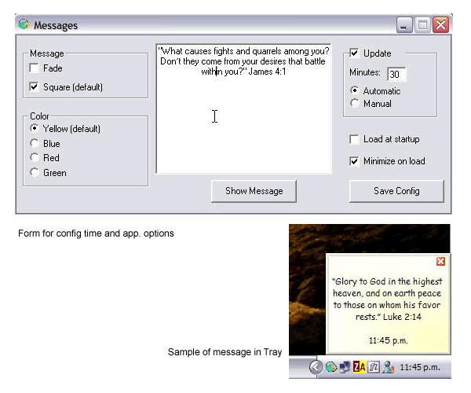

<div align="center">

## Messages


</div>

### Description

This application was designed to show messages from a text file. Originally it show Bible verses. The file messages.txt can be edited to add or enter your own messages. Through interface you can define the time interval for display the messages. Usefull for students for remember assigments that need memorize and for every one who wants to show different messages for reading or memorize.

I made this app, using several codes found here in PSC. Particurally 'Windows Alerts' recently code of the month. This implementation is more complex but not an upgrade to the original. In this code you will find, how to implement sound to messages, about read and write INI files for configuration, read and display text form a text file, registry for load app at startup, use TrayIcon and other routines.

Main code is fully commented. The code is in Spanish and English because I created originally in spanish, I redo the main form for English programmers.

Hope you like it and wait for your comments, suggestions, and votes. I have some ideas for next version. First time submission here.
 
### More Info
 
I made this app, using several codes found here in PSC. Particurally 'Windows Alerts' recently code of the month. This implementation is more complex but not an upgrade to the original. In this code you will find, how to implement sound to messages, about read and write INI files for configuration, read and display text form a text file, registry for load app at startup, use TrayIcon and other routines.

Main code is fully commented. The code is in Spanish and English because I created originally in spanish, I redo the main form for English programmers.

Hope you like it and wait for your comments, suggestions, and votes. I have some ideas for next version. First time submission here.

If time for show message is less that time from launch screensaver, the screensave will not be showed.


<span>             |<span>
---                |---
**Submitted On**   |2004-05-06 23:51:18
**By**             |[Juan Carlos Pazos](https://github.com/Planet-Source-Code/PSCIndex/blob/master/ByAuthor/juan-carlos-pazos.md)
**Level**          |Intermediate
**User Rating**    |5.0 (60 globes from 12 users)
**Compatibility**  |VB 6\.0
**Category**       |[Complete Applications](https://github.com/Planet-Source-Code/PSCIndex/blob/master/ByCategory/complete-applications__1-27.md)
**World**          |[Visual Basic](https://github.com/Planet-Source-Code/PSCIndex/blob/master/ByWorld/visual-basic.md)
**Archive File**   |[Messages174242572004\.zip](https://github.com/Planet-Source-Code/juan-carlos-pazos-messages__1-53627/archive/master.zip)

### API Declarations

```
Option Explicit
'******************************************************************************
' Este programa fue diseñado originalmente para mostrar automáticamnete
' versículos biblícos. Puede editarse el archivo mensajes.txt para mostrar
' cualquier mensaje(s) que se quiera a intervalos de tiempo programados.
'
' This application was designed to show Bible verses. The file messages.txt can
' be edited to add or enter your own messages. Through interface you can define
' the time interval for display the messages.
... Download the file
```


